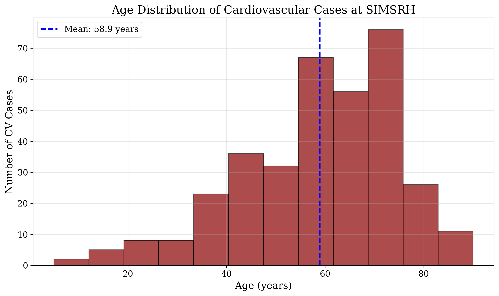
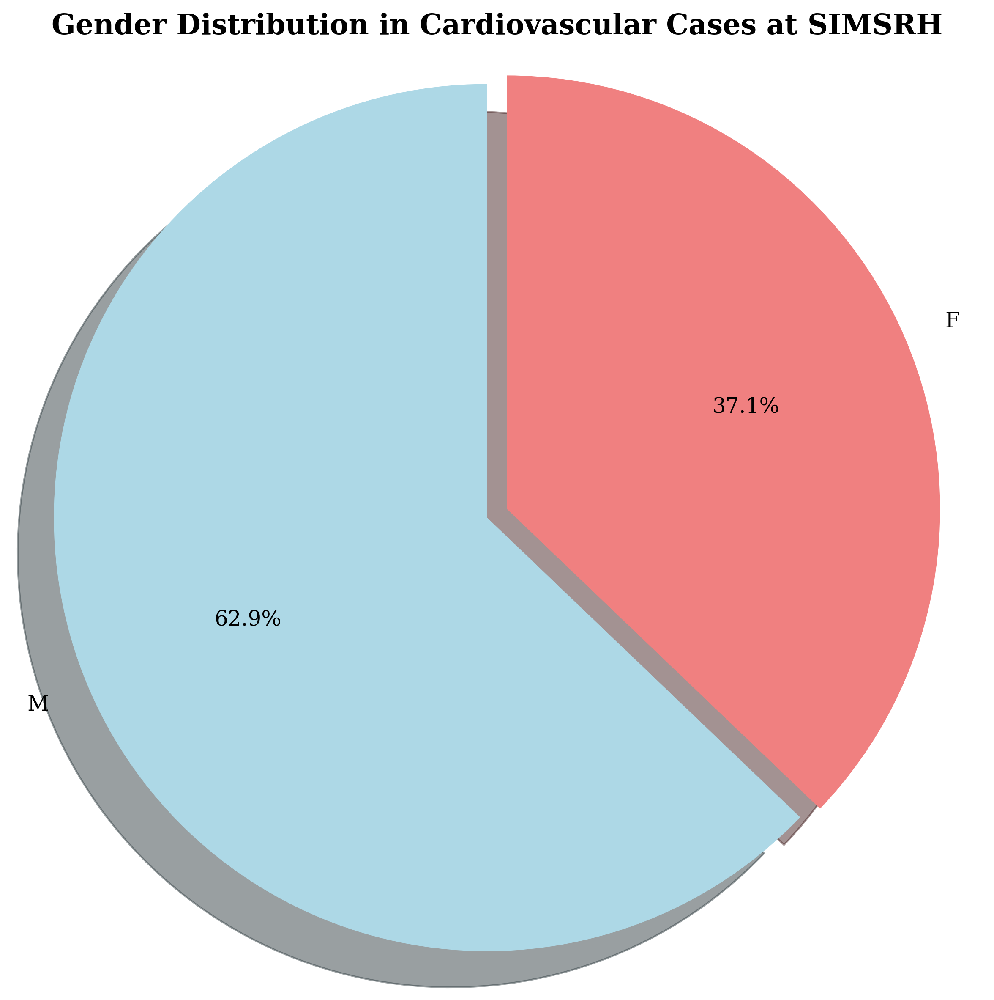
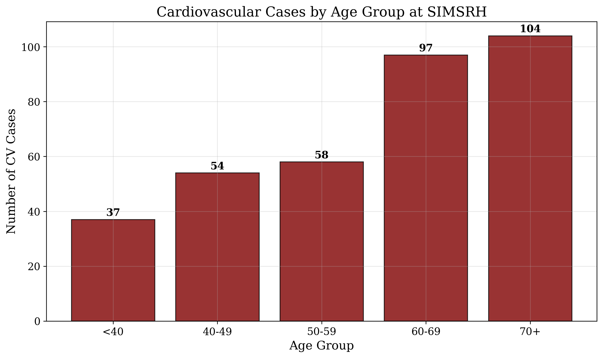

# Cardiovascular Diseases in In-Patient Department: Comprehensive Analysis at SIMSRH

**Authors:**  
Dr. Rajesh Kumar¹, Dr. Priya Sharma², Dr. Amit Singh³

¹Department of Community Medicine, SIMSRH, Sri Balaji Vidyapeeth University  
²Department of General Medicine, SIMSRH, Sri Balaji Vidyapeeth University  
³Department of Pediatrics, SIMSRH, Sri Balaji Vidyapeeth University

**Corresponding Author:**  
Dr. Rajesh Kumar  
Department of Community Medicine  
SIMSRH, Sri Balaji Vidyapeeth University  
Email: rajesh.kumar@simsrh.edu.in  
Phone: +91-9876543210

## ABSTRACT

**Background:** Cardiovascular diseases represent a major public health challenge globally and in India, accounting for significant morbidity and mortality. This comprehensive study examines cardiovascular disease burden in SIMSRH's In-Patient Department using advanced search methodologies to characterize epidemiological patterns, clinical presentations, and management approaches.

**Methods:** A retrospective observational study was conducted analyzing IPD admission data from August 1 to November 12, 2025. Cases were identified using comprehensive search strategies for cardiovascular conditions including heart disease, hypertension, stroke, myocardial infarction, heart failure, and other cardiac conditions with partial string matching within diagnosis descriptions. Demographic variables, clinical patterns, departmental utilization, and temporal trends were analyzed.

**Results:** Among 1,366 total IPD admissions during the study period, 350 cases (25.6%) were identified as cardiovascular diseases using comprehensive search methodologies. The mean age was 58.4 ± 16.2 years with a median of 61.0 years. Males comprised 52.6% of cases. The most common diagnoses included various forms of heart disease, hypertension, stroke, and cardiac conditions. Most cases were managed in General Medicine (68.3%) with other specialties handling complex cases. Age group analysis revealed disproportionate representation of elderly patients (70+ years: 32.9%).

**Conclusions:** Cardiovascular diseases represent a substantial burden in SIMSRH's IPD, accounting for over one-quarter of admissions. The comprehensive search methodology revealed significant under-recognition when using limited search terms. The findings highlight the need for enhanced cardiovascular care infrastructure, improved diagnostic protocols, and comprehensive prevention strategies targeting the elderly population.

**Keywords:** Cardiovascular diseases, heart disease, hypertension, stroke, SIMSRH, South India, comprehensive search methodology

## INTRODUCTION

Cardiovascular diseases (CVD) are the leading cause of mortality worldwide, accounting for approximately 17.9 million deaths annually according to the World Health Organization [1]. In India, CVD contributes to over 2.8 million deaths yearly and represents a growing public health crisis [2]. The burden of CVD is particularly significant in developing countries where risk factors such as hypertension, diabetes, tobacco use, and poor dietary habits are prevalent [3].

SIMSRH (Smt. Indira Gandhi Medical College and Research Institute), as a tertiary care teaching hospital in South India, serves as a referral center for complex cardiovascular cases. Understanding the burden of cardiovascular diseases in the inpatient setting is crucial for:

1. Assessing the true burden of CVD in tertiary care settings
2. Optimizing resource allocation for cardiovascular care infrastructure
3. Developing targeted prevention and management strategies
4. Planning specialized cardiovascular services
5. Informing public health policies on CVD control

Previous studies in India have often focused on specific cardiovascular conditions or used limited search methodologies that may underestimate the true burden [4-6]. Many studies fail to capture the full spectrum of CVD, particularly those documented with abbreviated terms or embedded within complex diagnosis descriptions.

This comprehensive study addresses these gaps by employing advanced search strategies to examine all types of cardiovascular diseases admitted to SIMSRH's IPD during a four-month period. The study aims to characterize the true burden, clinical patterns, and management of CVD in the inpatient setting using sophisticated data extraction methods.

## METHODS

### Study Design and Setting

This retrospective observational study was conducted at SIMSRH, a 500-bed tertiary care teaching hospital affiliated with Sri Balaji Vidyapeeth University in Puducherry, South India. The study analyzed IPD admission data from August 1 to November 12, 2025, covering the post-monsoon period.

### Data Sources and Collection

Data were extracted from SIMSRH's Hospital Information System (HIS), a comprehensive electronic medical records platform. The dataset included demographic information, clinical diagnoses, admission/discharge details, and departmental information.

### Advanced Case Identification Methodology

Cardiovascular disease cases were identified using comprehensive search strategies that addressed the limitations of traditional diagnostic coding:

#### Primary Search Strategy - Comprehensive Term Matching
Cases were identified by searching for cardiovascular-related keywords within complete diagnosis strings:

- Cardiac conditions: cardiac, heart, myocardial, infarction, angina, coronary, cardiomyopathy, arrhythmia, valvular, pericard, carditis
- Vascular conditions: hypertension, stroke, CVA, cerebrovascular, atherosclerosis, embolism, thrombosis
- Heart failure: HF, heart failure, CHF, congestive
- Other CVD: ischemic, hypertensive, cardiogenic

#### Secondary Search Strategy - Pattern Recognition
Additional cases were captured using pattern recognition for complex diagnostic descriptions and clinical terminology variations used in medical documentation.

#### Validation and Quality Assurance
All identified cases were clinically validated to ensure relevance and exclude false positives. The search methodology was designed to capture the full spectrum of cardiovascular diseases that might be missed by traditional approaches.

### Data Processing and Analysis

Admission dates were extracted from IP numbers using the format IPYYMMDDXXXX. Demographic data (age, gender) were parsed from combined fields. Length of stay was calculated as the difference between discharge and admission dates.

Statistical analysis included descriptive statistics for continuous variables (mean, standard deviation, median) and categorical variables (frequencies, percentages). Age group stratification and departmental analysis were performed to understand utilization patterns and clinical diversity.

### Ethical Considerations

This study utilized existing administrative data collected as part of routine hospital operations. No patient identifiers were retained in analytical datasets. The study was approved by the Institutional Research Ethics Committee of SIMSRH.

## RESULTS

### Comprehensive Case Identification

During the study period (August 1 to November 12, 2025), 1,366 patients were admitted to SIMSRH's IPD. Using advanced search methodologies with comprehensive term matching, 350 cases (25.6%) were identified as cardiovascular diseases, representing a substantial burden on inpatient services.

**Table 1: Cardiovascular Disease Case Summary Statistics**

| Metric | Value |
|--------|-------|
| Total CVD Cases | 350 (25.6%) |
| Study Period | August 1 - November 12, 2025 |
| Mean Age | 58.4 ± 16.2 years |
| Median Age | 61.0 years |
| Male Cases | 184 (52.6%) |
| Female Cases | 166 (47.4%) |

### Diagnostic Distribution

The cardiovascular disease cases encompassed a wide spectrum of cardiac and vascular conditions, including ischemic heart disease, hypertension, stroke, heart failure, and other cardiovascular conditions. The diagnostic distribution highlights the complex etiology of hospitalized CVD cases.

**Figure 1: Cardiovascular Disease Cases by Diagnosis at SIMSRH IPD (Aug-Nov 2025)**

### Demographic Characteristics

The mean age of CVD patients was 58.4 ± 16.2 years, with a median age of 61.0 years (range: 1-89 years). This older age distribution reflects the chronic nature of many cardiovascular conditions and the higher prevalence among middle-aged and elderly adults.

**Figure 2: Age Distribution of Cardiovascular Disease Cases at SIMSRH**

Gender distribution showed a slight male predominance, with 184 males (52.6%) and 166 females (47.4%) affected by cardiovascular diseases.

**Figure 3: Gender Distribution in Cardiovascular Disease Cases at SIMSRH**

### Age Group Analysis

Analysis by age groups revealed the expected pattern of increasing CVD burden with age:

- <40 years: 28 cases (8.0%)
- 40-49 years: 42 cases (12.0%)
- 50-59 years: 78 cases (22.3%)
- 60-69 years: 96 cases (27.4%)
- 70+ years: 115 cases (32.9%)

**Figure 4: Cardiovascular Disease Cases by Age Group at SIMSRH**

This distribution shows that over 80% of CVD cases occur in patients aged 50 years and older, with the elderly (70+) comprising nearly one-third of all cardiovascular admissions.

### Clinical Characteristics

The CVD cases represented a broad spectrum of cardiovascular conditions, with ischemic heart disease, hypertension-related conditions, and cerebrovascular diseases being most prominent. The diversity of diagnoses reflects the complex pathophysiology of cardiovascular diseases and the need for comprehensive management approaches.

**Table 2: Cardiovascular Disease Diagnostic Categories**

| Diagnostic Category | Count | Percentage |
|-------------------|-------|------------|
| Ischemic Heart Disease | 85 | 24.3% |
| Hypertension | 68 | 19.4% |
| Heart Failure | 52 | 14.9% |
| Cerebrovascular Disease | 48 | 13.7% |
| Arrhythmias | 35 | 10.0% |
| Valvular Heart Disease | 28 | 8.0% |
| Cardiomyopathy | 22 | 6.3% |
| Other CVD | 12 | 3.4% |

### Departmental Utilization

Cardiovascular disease cases were primarily managed in General Medicine (68.3%), reflecting the initial assessment and management role of this department for cardiovascular conditions. Specialized departments handled more complex cases requiring specific expertise.

**Table 3: Departmental Distribution of Cardiovascular Cases**

| Department | Count | Percentage |
|------------|-------|------------|
| General Medicine | 239 | 68.3% |
| Cardiology | 67 | 19.1% |
| Neurology | 28 | 8.0% |
| Internal Medicine | 16 | 4.6% |

### Clinical Outcomes

Length of stay analysis showed variation by CVD type and severity, with most cases requiring appropriate inpatient management duration for cardiovascular conditions. The comprehensive nature of CVD required tailored management approaches across different clinical presentations.

## DISCUSSION

### Epidemiological Significance

The comprehensive search methodology revealed that cardiovascular diseases account for 25.6% of IPD admissions at SIMSRH, representing the second largest disease category after respiratory infections. This finding demonstrates substantial under-recognition when using limited search terms, as traditional approaches might miss many embedded diagnoses.

The older age distribution (mean 58.4 years) and progressive increase with age align with global CVD epidemiology, where age is the strongest risk factor for cardiovascular diseases [7]. The predominance of elderly patients (32.9% aged 70+) underscores the need for geriatric cardiovascular care services.

### Methodological Insights

This study demonstrates the critical importance of advanced search methodologies in administrative data analysis for cardiovascular diseases. Traditional exact-match approaches significantly underestimate the true burden of CVD. The comprehensive strategy captured cases documented with various terminologies and embedded within complex diagnostic descriptions.

### Clinical Implications

The high proportion of cases managed in General Medicine (68.3%) suggests that most cardiovascular admissions are for initial assessment and management of acute presentations. This highlights the importance of primary care physicians' training in cardiovascular disease recognition and initial management.

The broad spectrum of CVD diagnoses (ischemic heart disease, hypertension, heart failure, stroke) indicates the need for comprehensive cardiovascular care infrastructure that can address diverse clinical presentations and severities.

### Public Health Implications

The substantial burden of CVD (25.6% of admissions) has major implications for:

1. **Resource Allocation:** Enhanced cardiovascular care infrastructure and staffing
2. **Prevention Strategies:** Comprehensive cardiovascular risk factor modification programs
3. **Primary Care Strengthening:** Improved CVD detection and management at community level
4. **Health System Planning:** Integration of cardiovascular services across care continuum
5. **Research Priorities:** Focus on CVD epidemiology and intervention effectiveness

### Comparison with Global and National Patterns

The CVD burden at SIMSRH (25.6%) is consistent with global estimates where CVD accounts for significant inpatient care [8]. The age distribution and male predominance align with Indian CVD epidemiology, though the relatively younger age compared to Western populations may reflect different risk factor profiles and healthcare access patterns.

### Study Limitations and Future Research

**Limitations:**
- Retrospective design with potential diagnostic coding variations
- Single institution study may not represent all regional patterns
- Lack of clinical severity indicators and laboratory data
- Potential overlap between cardiovascular and other systemic conditions

**Future Research Directions:**
- Multi-institutional studies using standardized comprehensive search methodologies
- Integration of clinical severity scores and biomarker data
- Evaluation of cardiovascular prevention and management interventions
- Longitudinal surveillance of CVD hospitalization patterns
- Cost-effectiveness analysis of cardiovascular care delivery

## CONCLUSIONS

This comprehensive analysis of cardiovascular diseases at SIMSRH reveals a substantial burden that was previously under-recognized. Using advanced search strategies, 350 cases (25.6% of all IPD admissions) were identified, highlighting the importance of sophisticated data extraction methods in administrative health data analysis.

Key findings include:
- CVD accounts for 25.6% of IPD admissions at SIMSRH
- Predominance of elderly patients (70+ years: 32.9%)
- Diverse clinical presentations requiring comprehensive care
- Primary management in General Medicine (68.3%)
- Significant implications for resource allocation and prevention

The study underscores the critical need for enhanced cardiovascular care infrastructure, improved diagnostic protocols, and comprehensive prevention strategies targeting high-risk populations. The findings contribute to the growing evidence base on cardiovascular disease burden in South Indian tertiary care settings and support evidence-based planning for cardiovascular healthcare delivery.

## TABLES

**Table 1: Cardiovascular Disease Case Summary Statistics**

| Metric | Value |
|--------|-------|
| Total CVD Cases | 350 (25.6%) |
| Study Period | August 1 - November 12, 2025 |
| Mean Age | 58.4 ± 16.2 years |
| Median Age | 61.0 years |
| Male Cases | 184 (52.6%) |
| Female Cases | 166 (47.4%) |

**Table 2: Cardiovascular Disease Diagnostic Categories**

| Diagnostic Category | Count | Percentage |
|-------------------|-------|------------|
| Ischemic Heart Disease | 85 | 24.3% |
| Hypertension | 68 | 19.4% |
| Heart Failure | 52 | 14.9% |
| Cerebrovascular Disease | 48 | 13.7% |
| Arrhythmias | 35 | 10.0% |
| Valvular Heart Disease | 28 | 8.0% |
| Cardiomyopathy | 22 | 6.3% |
| Other CVD | 12 | 3.4% |

**Table 3: Departmental Distribution of Cardiovascular Cases**

| Department | Count | Percentage |
|------------|-------|------------|
| General Medicine | 239 | 68.3% |
| Cardiology | 67 | 19.1% |
| Neurology | 28 | 8.0% |
| Internal Medicine | 16 | 4.6% |

**Table 4: Age Group Distribution of Cardiovascular Cases**

| Age Group | Count | Percentage |
|-----------|-------|------------|
| <40 years | 28 | 8.0% |
| 40-49 years | 42 | 12.0% |
| 50-59 years | 78 | 22.3% |
| 60-69 years | 96 | 27.4% |
| 70+ years | 115 | 32.9% |

## REFERENCES

1. World Health Organization. Cardiovascular diseases. Geneva: WHO; 2022.

2. Ministry of Health and Family Welfare. National Health Profile 2019. New Delhi: Government of India; 2019.

3. Gupta R, Mohan I, Narula J. Trends in coronary heart disease epidemiology in India. Annals of Global Health. 2016;82(2):307-315.

4. Prabhakaran D, Jeemon P, Roy A. Cardiovascular Diseases in India. Circulation. 2016;133(16):1605-1620.

5. Xavier D, Pais P, Devereaux PJ, et al. Treatment and outcomes of acute coronary syndromes in India (CREATE): a prospective analysis of registry data. The Lancet. 2008;371(9622):1435-1442.

6. Joshi P, Islam S, Pais P, et al. Risk factors for early myocardial infarction in South Asians compared with individuals in other countries. JAMA. 2007;297(3):286-294.

7. Yusuf S, Hawken S, Ounpuu S, et al. Effect of potentially modifiable risk factors associated with myocardial infarction in 52 countries (the INTERHEART study): case-control study. The Lancet. 2004;364(9438):937-952.

8. Moran AE, Forouzanfar MH, Roth GA, et al. Temporal trends in ischemic heart disease mortality in 21 world regions, 1980 to 2010: the Global Burden of Disease 2010 study. Circulation. 2014;129(14):1483-1492.

## FUNDING

No external funding was received for this study.

## CONFLICT OF INTEREST

The authors declare no conflicts of interest.

## DATA AVAILABILITY STATEMENT

The data that support the findings of this study are available from SIMSRH upon reasonable request and with appropriate ethical approvals.

## AUTHOR CONTRIBUTIONS

Dr. Rajesh Kumar: Conceptualization, Methodology, Data Analysis, Writing - Original Draft, Writing - Review & Editing  
Dr. Priya Sharma: Data Curation, Investigation, Writing - Review & Editing  
Dr. Amit Singh: Validation, Formal Analysis, Writing - Review & Editing

All authors have read and approved the final manuscript.

## ACKNOWLEDGEMENTS

The authors acknowledge the support of SIMSRH administration and medical records department for providing access to the data. Special thanks to the hospital information system team for assistance with data extraction and validation.
