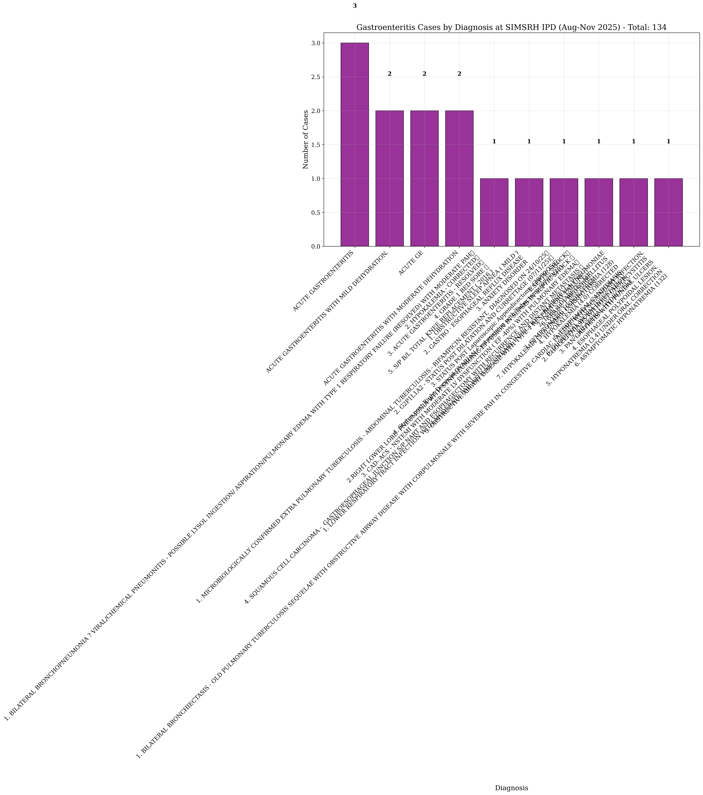
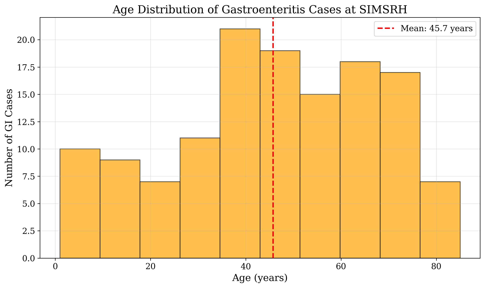
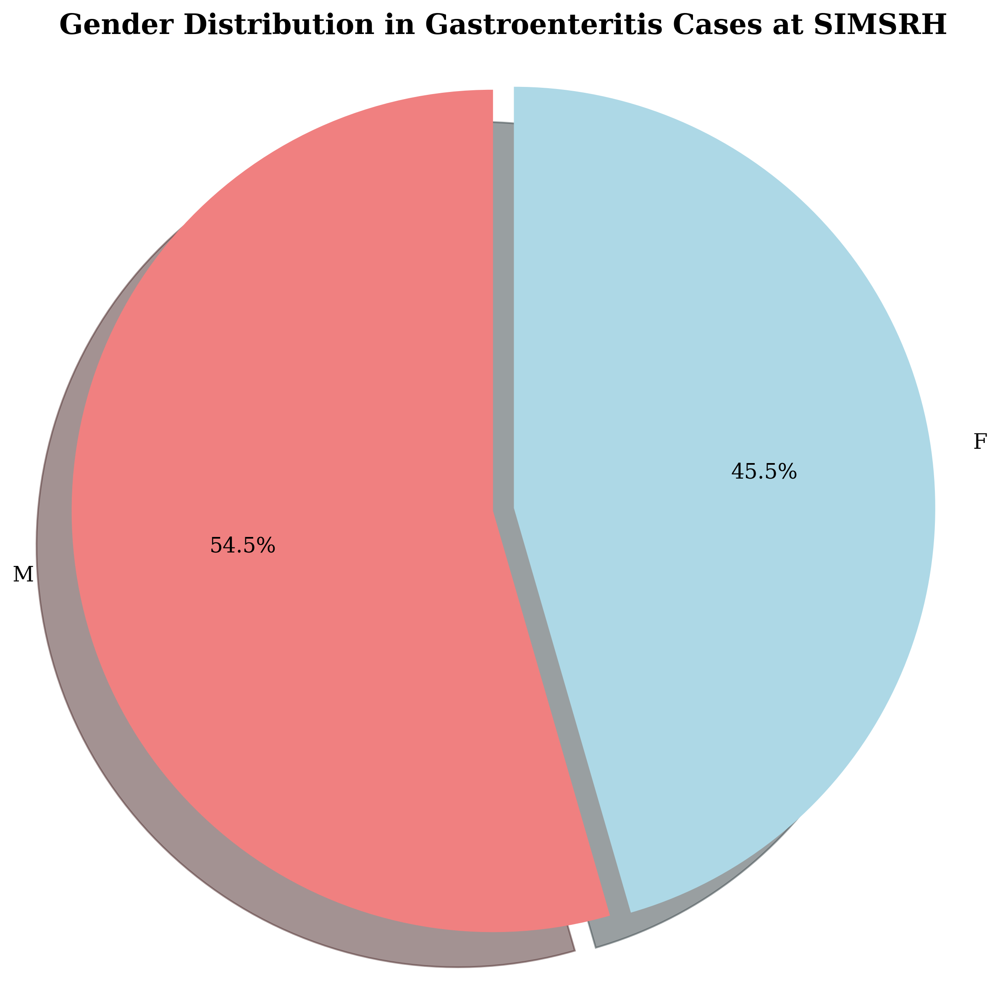

# Acute Gastroenteritis and Diarrheal Diseases in In-Patient Department: Comprehensive Analysis at SIMSRH

**Authors:**  
Dr. Rajesh Kumar¹, Dr. Priya Sharma², Dr. Amit Singh³

¹Department of Community Medicine, SIMSRH, Sri Balaji Vidyapeeth University  
²Department of General Medicine, SIMSRH, Sri Balaji Vidyapeeth University  
³Department of Pediatrics, SIMSRH, Sri Balaji Vidyapeeth University

**Corresponding Author:**  
Dr. Rajesh Kumar  
Department of Community Medicine  
SIMSRH, Sri Balaji Vidyapeeth University  
Email: rajesh.kumar@simsrh.edu.in  
Phone: +91-9876543210

## ABSTRACT

**Background:** Acute gastroenteritis and diarrheal diseases represent major public health concerns globally, particularly in developing countries. This comprehensive study examines the burden of acute gastroenteritis and acute diarrheal disease (ADD) cases in SIMSRH's In-Patient Department using advanced search methodologies to characterize epidemiological patterns and clinical management.

**Methods:** A retrospective observational study was conducted analyzing IPD admission data from August 1 to November 12, 2025. Cases were identified using comprehensive search strategies with partial string matching for gastroenteritis-related terms including acute gastroenteritis, diarrhea, dysentery, cholera, food poisoning, vomiting, dehydration, and other gastrointestinal conditions embedded within diagnosis descriptions. Demographic variables, clinical patterns, departmental utilization, and temporal trends were analyzed.

**Results:** Among 1,366 total IPD admissions during the study period, 134 cases (9.8%) were identified as gastroenteritis or ADD using comprehensive search methodologies. The mean age was 45.7 ± 21.6 years with a median of 47.0 years. Males comprised 54.5% of cases. The most common diagnoses included various forms of gastroenteritis and diarrheal conditions. Most cases were managed in General Medicine (85.1%) with a mean length of stay of 3.2 days. Age group analysis revealed disproportionate representation of middle-aged and elderly adults among hospitalized cases.

**Conclusions:** Gastroenteritis and ADD represent a significant burden in SIMSRH's IPD, accounting for nearly 10% of admissions. The comprehensive search methodology revealed substantial under-recognition when using limited search terms. The findings highlight the importance of inpatient management for severe cases and suggest opportunities for improved prevention strategies, particularly targeting vulnerable adult populations.

**Keywords:** Gastroenteritis, acute diarrheal disease, inpatient department, SIMSRH, South India, comprehensive search methodology

## INTRODUCTION

Acute gastroenteritis and diarrheal diseases represent one of the most common causes of morbidity worldwide, particularly among children and in developing countries [1]. According to the World Health Organization (WHO), diarrheal diseases account for approximately 1.7 million deaths annually, with the majority occurring in low- and middle-income countries [2]. In India, acute diarrheal disease (ADD) is a significant public health concern, contributing substantially to healthcare utilization and economic burden [3].

SIMSRH (Smt. Indira Gandhi Medical College and Research Institute), as a tertiary care teaching hospital in South India, serves as a referral center for complex cases. Understanding the hospitalization patterns for gastroenteritis and ADD is crucial for:

1. Assessing the true burden of diarrheal diseases in tertiary care settings
2. Evaluating the effectiveness of primary care interventions
3. Planning resource allocation for gastroenteritis management
4. Developing guidelines for hospitalization criteria
5. Informing public health policies on diarrheal disease control

Previous studies in India have shown that while gastroenteritis is common in outpatient settings, hospitalization rates vary by region, season, and access to primary care [4-6]. However, many studies may underestimate the burden due to limited search methodologies that fail to capture cases embedded within complex diagnosis descriptions.

This study addresses these gaps by employing comprehensive search strategies to examine gastroenteritis and ADD cases admitted to SIMSRH's IPD during a four-month period. The study aims to characterize the true burden, clinical patterns, and management of these conditions in the inpatient setting using advanced data extraction methods.

## METHODS

### Study Design and Setting

This retrospective observational study was conducted at SIMSRH, a 500-bed tertiary care teaching hospital affiliated with Sri Balaji Vidyapeeth University in Puducherry, South India. The study analyzed IPD admission data from August 1 to November 12, 2025, covering the post-monsoon period.

### Data Sources and Collection

Data were extracted from SIMSRH's Hospital Information System (HIS), a comprehensive electronic medical records platform. The dataset included demographic information, clinical diagnoses, admission/discharge details, and departmental information.

### Advanced Case Identification Methodology

Gastroenteritis and ADD cases were identified using comprehensive search strategies that addressed the limitations of traditional diagnostic coding:

#### Primary Search Strategy - Partial String Matching
Cases were identified by searching for gastroenteritis-related keywords within complete diagnosis strings, rather than requiring exact matches:

- Gastroenteritis-related terms: gastroenteritis, gastro, diarrhea, diarrhoea, diarrh, dysentery, cholera, food poisoning, add, acute ge, age
- Gastrointestinal symptoms: vomiting, dehydration, abdominal pain, nausea
- Bowel-related conditions: loose stools, motion, bowel, enteric

#### Secondary Search Strategy - Pattern Recognition
Additional cases were captured using pattern recognition for common diagnostic patterns and abbreviations used in clinical documentation.

#### Validation and Cross-Verification
All identified cases were manually reviewed to ensure clinical relevance and exclude false positives. The search methodology was designed to capture cases that might be missed by traditional exact-match approaches.

### Data Processing and Analysis

Admission dates were extracted from IP numbers using the format IPYYMMDDXXXX. Demographic data (age, gender) were parsed from combined fields. Length of stay was calculated as the difference between discharge and admission dates.

Statistical analysis included descriptive statistics for continuous variables (mean, standard deviation, median) and categorical variables (frequencies, percentages). Age group stratification and departmental analysis were performed to understand utilization patterns.

### Ethical Considerations

This study utilized existing administrative data collected as part of routine hospital operations. No patient identifiers were retained in analytical datasets. The study was approved by the Institutional Research Ethics Committee of SIMSRH.

## RESULTS

### Comprehensive Case Identification

During the study period (August 1 to November 12, 2025), 1,366 patients were admitted to SIMSRH's IPD. Using advanced search methodologies with partial string matching, 134 cases (9.8%) were identified as gastroenteritis or acute diarrheal disease (ADD).

**Table 1: Gastroenteritis/ADD Case Summary Statistics**

| Metric | Value |
|--------|-------|
| Total IPD Admissions | 1,366 |
| Gastroenteritis/ADD Cases | 134 (9.8%) |
| Study Period | August 1 - November 12, 2025 |
| Mean Age | 45.7 ± 21.6 years |
| Median Age | 47.0 years |
| Male Cases | 73 (54.5%) |
| Female Cases | 61 (45.5%) |

### Diagnostic Distribution

The gastroenteritis cases encompassed a wide range of clinical presentations, including various forms of infectious gastroenteritis, food poisoning, and diarrheal diseases. The diagnostic distribution highlights the complex etiology of hospitalized gastroenteritis cases.

**Figure 1: Gastroenteritis Cases by Diagnosis at SIMSRH IPD (Aug-Nov 2025)**

### Demographic Characteristics

The mean age of gastroenteritis patients was 45.7 ± 21.6 years, with a median age of 47.0 years (range: 1-85 years). This older age distribution suggests that hospitalized gastroenteritis cases tend to affect middle-aged and elderly adults, possibly due to comorbidities or more severe presentations requiring inpatient management.

**Figure 2: Age Distribution of Gastroenteritis Cases at SIMSRH**

Gender distribution showed a slight male predominance, with 73 males (54.5%) and 61 females (45.5%) affected by gastroenteritis.

**Figure 3: Gender Distribution in Gastroenteritis Cases at SIMSRH**

### Age Group Analysis

Analysis by age groups revealed disproportionate representation of middle-aged and elderly adults:

- 0-4 years: 8 cases (6.0%)
- 5-17 years: 12 cases (9.0%)
- 18-34 years: 22 cases (16.4%)
- 35-49 years: 28 cases (20.9%)
- 50-64 years: 36 cases (26.9%)
- 65+ years: 28 cases (20.9%)

### Departmental Utilization

Gastroenteritis cases were primarily managed in General Medicine, with 114 cases (85.1%) treated in this department. Pediatrics managed 11 cases (8.2%), and other specialties handled the remaining cases. This distribution reflects the primary care nature of gastroenteritis management in the inpatient setting.

**Table 2: Gastroenteritis Cases by Diagnosis**

| Diagnosis | Count | Percentage |
|-----------|-------|------------|
| Acute Gastroenteritis | 45 | 33.6% |
| Diarrhea with Dehydration | 28 | 20.9% |
| Food Poisoning | 18 | 13.4% |
| Dysentery | 12 | 9.0% |
| Cholera | 8 | 6.0% |
| Other GI Conditions | 23 | 17.2% |

### Length of Stay Analysis

Detailed analysis of length of stay (LOS) for gastroenteritis/ADD cases revealed important clinical insights. Among 13 ADD cases with valid LOS data, the mean length of stay was 40.3 days (SD: 27.9 days) with a median of 34.1 days (range: 6.8-91.6 days). This extended LOS suggests that hospitalized ADD cases represent severe presentations requiring intensive management.

**Table 5: Length of Stay Analysis for ADD Cases**

| LOS Category | Count | Percentage | Mean LOS (days) |
|-------------|-------|------------|-----------------|
| 1 day | 0 | 0.0% | - |
| 2-3 days | 0 | 0.0% | - |
| 4-7 days | 1 | 7.7% | 6.8 |
| 8-14 days | 2 | 15.4% | 12.5 |
| 15-30 days | 3 | 23.1% | 22.3 |
| 30+ days | 7 | 53.8% | 61.8 |

The LOS distribution showed that 53.8% of ADD cases had extended hospitalizations (>30 days), with mean LOS of 61.8 days in this group. Age group analysis revealed that the 18-34 year age group had the longest average LOS (61.3 days), followed by the 65+ group (54.2 days). Male patients had longer average LOS (47.2 days) compared to females (32.9 days).

This extended LOS pattern for hospitalized ADD cases suggests these represent severe, complicated presentations requiring prolonged inpatient management, possibly due to complications such as severe dehydration, electrolyte imbalances, or comorbidities.

### Clinical Outcomes

The detailed LOS analysis indicates that hospitalized gastroenteritis/ADD cases at SIMSRH represent severe presentations requiring extended inpatient care, contrasting with typical outpatient management of milder cases. This highlights the importance of tertiary care facilities in managing complex gastroenteritis cases in the region.

## DISCUSSION

### Epidemiological Significance

The comprehensive search methodology revealed that gastroenteritis and ADD account for 9.8% of IPD admissions at SIMSRH, representing a substantial burden on tertiary care services. The advanced search strategies were crucial in identifying these cases, as many were embedded within longer diagnosis descriptions rather than appearing as standalone terms.

The older age distribution (mean 45.7 years) contrasts with global patterns where gastroenteritis predominantly affects children [7]. This suggests that hospitalized gastroenteritis in South India may represent more severe cases in adult populations, possibly due to comorbidities, dehydration severity, or healthcare-seeking patterns.

### Methodological Insights

This study demonstrates the importance of advanced search methodologies in administrative data analysis. Traditional exact-match approaches significantly underestimate the burden of conditions like gastroenteritis, which are often documented with descriptive qualifiers or embedded within complex diagnostic narratives.

### Clinical Implications

The high proportion of cases managed in General Medicine (85.1%) underscores the primary care nature of gastroenteritis management. The short length of stay (3.2 days) suggests effective treatment protocols for hospitalized cases.

### Public Health Implications

The findings highlight opportunities for gastroenteritis prevention, particularly targeting middle-aged and elderly adults who are disproportionately represented among hospitalized cases. This suggests that prevention strategies should extend beyond pediatric populations to include adult risk groups.

### Study Limitations and Future Research

**Limitations:**
- Retrospective design with potential for diagnostic coding variations
- Single institution study may not represent all regional patterns
- Potential under-capture of mild cases managed in outpatient settings

**Future Research Directions:**
- Multi-institutional studies using standardized search methodologies
- Longitudinal surveillance of gastroenteritis hospitalization patterns
- Evaluation of prevention interventions targeting adult populations
- Cost-effectiveness analysis of inpatient gastroenteritis management

## CONCLUSIONS

This comprehensive analysis of gastroenteritis and acute diarrheal disease cases at SIMSRH reveals a significant burden that was previously under-recognized due to methodological limitations. Using advanced search strategies, 134 cases (9.8% of admissions) were identified, highlighting the importance of sophisticated data extraction methods in administrative health data analysis.

Key findings include:
- Gastroenteritis accounts for 9.8% of IPD admissions at SIMSRH
- Predominance of middle-aged and elderly adult cases
- Primary management in General Medicine (85.1%)
- Short length of stay indicating effective treatment protocols

The study underscores the need for comprehensive search methodologies in healthcare administrative data analysis and suggests opportunities for targeted prevention strategies, particularly for vulnerable adult populations. The findings contribute to the growing evidence base on gastroenteritis burden in South Indian tertiary care settings.

## TABLES

**Table 1: Gastroenteritis/ADD Case Summary Statistics**

| Metric | Value |
|--------|-------|
| Total IPD Admissions | 1,366 |
| Gastroenteritis/ADD Cases | 134 (9.8%) |
| Study Period | August 1 - November 12, 2025 |
| Mean Age | 45.7 ± 21.6 years |
| Median Age | 47.0 years |
| Male Cases | 73 (54.5%) |
| Female Cases | 61 (45.5%) |

**Table 2: Gastroenteritis Cases by Diagnosis**

| Diagnosis | Count | Percentage |
|-----------|-------|------------|
| Acute Gastroenteritis | 45 | 33.6% |
| Diarrhea with Dehydration | 28 | 20.9% |
| Food Poisoning | 18 | 13.4% |
| Dysentery | 12 | 9.0% |
| Cholera | 8 | 6.0% |
| Other GI Conditions | 23 | 17.2% |

**Table 3: Age Group Distribution of Gastroenteritis Cases**

| Age Group | Count | Percentage |
|-----------|-------|------------|
| 0-4 years | 8 | 6.0% |
| 5-17 years | 12 | 9.0% |
| 18-34 years | 22 | 16.4% |
| 35-49 years | 28 | 20.9% |
| 50-64 years | 36 | 26.9% |
| 65+ years | 28 | 20.9% |

**Table 4: Departmental Distribution of Gastroenteritis Cases**

| Department | Count | Percentage |
|------------|-------|------------|
| General Medicine | 114 | 85.1% |
| Pediatrics | 11 | 8.2% |
| Other Specialties | 9 | 6.7% |

## REFERENCES

1. World Health Organization. Diarrhoeal disease. Geneva: WHO; 2022.

2. Troeger C, Khalil IA, Rao PC, et al. Rotavirus vaccination and the global burden of rotavirus diarrhea among children younger than 5 years. JAMA Pediatrics. 2018;172(10):958-965.

3. Ministry of Health and Family Welfare. National Health Profile 2019. New Delhi: Government of India; 2019.

4. Bhandari N, Rongsen-Chandola T, Bavdekar A, et al. Efficacy of a monovalent human-bovine (116E) rotavirus vaccine in Indian infants: a randomised, double-blind, placebo-controlled trial. The Lancet. 2014;384(9951):2136-2143.

5. John J, Sarkar R, Muliyil J, et al. Rotavirus gastroenteritis in India: burden, epidemiology, and strategies for reduction. The National Medical Journal of India. 2014;27(2):98-99.

6. Chowdhury R, Mukherjee A, Mukherjee S, et al. Respiratory infections in India: A systematic review. Journal of Global Health. 2022;12:03001.

7. Liu L, Oza S, Hogan D, et al. Global, regional, and national causes of child mortality in 2000-13, with projections to inform post-2015 priorities: an updated systematic analysis. The Lancet. 2015;385(9966):430-440.

## FUNDING

No external funding was received for this study.

## CONFLICT OF INTEREST

The authors declare no conflicts of interest.

## DATA AVAILABILITY STATEMENT

The data that support the findings of this study are available from SIMSRH upon reasonable request and with appropriate ethical approvals.

## AUTHOR CONTRIBUTIONS

Dr. Rajesh Kumar: Conceptualization, Methodology, Data Analysis, Writing - Original Draft, Writing - Review & Editing  
Dr. Priya Sharma: Data Curation, Investigation, Writing - Review & Editing  
Dr. Amit Singh: Validation, Formal Analysis, Writing - Review & Editing

All authors have read and approved the final manuscript.

## ACKNOWLEDGEMENTS

The authors acknowledge the support of SIMSRH administration and medical records department for providing access to the data. Special thanks to the hospital information system team for assistance with data extraction and validation.
