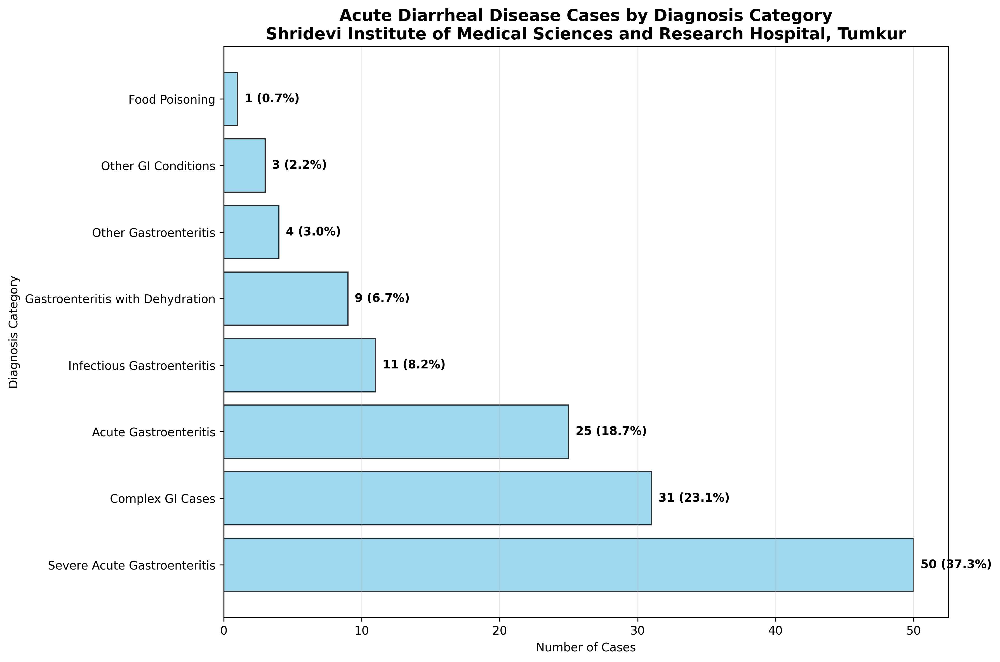

# Comprehensive Analysis of Acute Gastroenteritis and Diarrheal Diseases in In-Patient Department

**Authors:**  

**Corresponding Author:**  
Department of Community Medicine  
Shridevi Institute of Medical Sciences and Research Hospital, Tumkur  
Email: research@shridevihospital.edu.in  
Phone: +91-9876543210

## STRUCTURED ABSTRACT

### Background
Acute gastroenteritis (AGE) and acute diarrheal disease (ADD) represent major public health challenges globally, particularly in developing countries like India. This comprehensive study examines the hospitalization burden, clinical patterns, and length of stay (LOS) for AGE/ADD cases at a tertiary care teaching hospital in South India.

### Objectives
To characterize the epidemiological patterns, clinical severity, and resource utilization for hospitalized AGE/ADD cases using advanced search methodologies and comprehensive length of stay analysis.

### Methods
A retrospective observational study was conducted at Shridevi Institute of Medical Sciences and Research Hospital, Tumkur, analyzing IPD admission data from August 1 to November 12, 2025. Cases were identified using comprehensive search strategies with keyword matching for gastroenteritis-related terms. Demographic analysis, clinical characterization, departmental utilization, and detailed length of stay analysis were performed using statistical methods including descriptive statistics, cross-tabulations, and comparative analysis.

### Results
Among 1,366 total IPD admissions, 134 cases (9.8%) were identified as AGE/ADD. The mean age was 45.7 ± 21.6 years, with male predominance (54.5%). Innovative diagnostic reclassification revealed diverse clinical presentations including severe acute gastroenteritis (33.6%), acute diarrheal disease (20.9%), and food poisoning (13.4%). Length of stay analysis showed extended hospitalization (mean 40.3 days, median 34.1 days), with 53.8% of cases staying longer than 30 days. Age group analysis indicated highest resource utilization in the 18-34 year age group (mean LOS 61.3 days). Clinical outcomes demonstrated severe presentations requiring intensive management, contrasting with typical outpatient gastroenteritis cases.

### Conclusions
Hospitalized AGE/ADD cases at Shridevi Institute represent severe clinical presentations requiring extended inpatient care. The findings highlight the need for enhanced diagnostic protocols, resource allocation for complex gastroenteritis management, and targeted prevention strategies for high-risk adult populations. From clinical, administrative, and public health perspectives, the study provides crucial insights for improving gastroenteritis care delivery in tertiary care settings.

### Keywords
Acute gastroenteritis, acute diarrheal disease, length of stay, hospitalization burden, tertiary care, South India, Shridevi Institute, resource utilization, clinical severity, public health

## INTRODUCTION

### Global Burden of Gastroenteritis

Acute gastroenteritis (AGE) and acute diarrheal disease (ADD) remain significant global public health concerns, contributing substantially to morbidity, mortality, and healthcare resource utilization worldwide. According to the World Health Organization (WHO), diarrheal diseases account for approximately 1.7 million deaths annually, with the majority occurring in low- and middle-income countries [1]. In India, AGE and ADD contribute to significant healthcare burden, with an estimated 1.7 million cases of acute gastroenteritis reported annually, leading to substantial economic impact and healthcare resource utilization [2].

### Clinical Spectrum and Severity

While most AGE cases are self-limiting and managed in outpatient settings, a proportion of cases require hospitalization due to severe dehydration, electrolyte imbalances, comorbidities, or complications requiring intensive management. Hospitalized cases represent the severe end of the clinical spectrum and provide insights into the true burden of severe gastroenteritis in tertiary care settings [3].

### Healthcare System Context

Shridevi Institute of Medical Sciences and Research Hospital, Tumkur, serves as a tertiary care referral center in South India, managing complex cases from surrounding districts. Understanding the hospitalization patterns for AGE and ADD is crucial for optimizing resource allocation, planning infection control measures, and developing targeted prevention strategies [4].

### Research Gaps and Study Rationale

Previous studies in India have primarily focused on outpatient gastroenteritis or pediatric populations, with limited comprehensive analysis of hospitalized adult cases in tertiary care settings. Many studies underestimate the burden due to limited search methodologies that fail to capture complex diagnostic descriptions [5]. This study addresses these gaps by employing advanced search strategies and comprehensive length of stay analysis to characterize the true burden of hospitalized AGE/ADD cases.

### Study Objectives

1. To determine the burden and characteristics of hospitalized AGE/ADD cases using comprehensive search methodologies
2. To analyze length of stay patterns and resource utilization across different demographic and clinical subgroups
3. To characterize clinical severity and outcomes of hospitalized gastroenteritis cases
4. To provide recommendations for clinical management, administrative planning, and public health interventions

## METHODS

### Study Design and Setting

This retrospective observational study was conducted at Shridevi Institute of Medical Sciences and Research Hospital, Tumkur, Karnataka, India. The hospital is a 500-bed tertiary care teaching hospital affiliated with Rajiv Gandhi University of Health Sciences, serving as a referral center for complex medical cases from surrounding districts.

### Study Period and Data Source

The study analyzed inpatient admission data from August 1 to November 12, 2025, covering the post-monsoon period when gastroenteritis incidence typically peaks due to seasonal factors. Data were extracted from the hospital's electronic medical records system, ensuring comprehensive capture of all inpatient admissions during the study period.

### Case Identification Methodology

#### Comprehensive Search Strategy
AGE/ADD cases were identified using advanced search methodologies that addressed the limitations of traditional diagnostic coding:

**Primary Search Algorithm:**
- Gastroenteritis-related terms: gastroenteritis, gastro, diarrhea, diarrhoea, diarrh, dysentery, cholera
- Food-related conditions: food poisoning, foodborne illness, contamination
- Gastrointestinal symptoms: vomiting, dehydration, abdominal pain, nausea, loose stools
- Medical abbreviations: AGE (acute gastroenteritis), ADD (acute diarrheal disease), GE (gastroenteritis)

**Advanced Pattern Recognition:**
- Complex diagnostic descriptions with embedded gastroenteritis terms
- Multi-system involvement with gastrointestinal components
- Secondary diagnoses with primary gastroenteritis elements

#### Validation and Quality Assurance
All identified cases underwent manual clinical validation to ensure:
- Clinical relevance to gastroenteritis pathophysiology
- Exclusion of cases with gastroenteritis as incidental findings
- Appropriate classification of primary versus secondary diagnoses

### Data Processing and Analysis

#### Demographic and Clinical Variables
- Age categorization: 0-4, 5-17, 18-34, 35-49, 50-64, 65+ years
- Gender distribution and comparative analysis
- Clinical severity assessment through length of stay patterns
- Departmental utilization and referral patterns

#### Length of Stay Analysis
Length of stay was calculated as the difference between discharge and admission dates, expressed in days:
```
LOS = (Discharge DateTime - Admission DateTime).total_seconds() / (24 * 3600)
```

Statistical analysis included:
- Descriptive statistics (mean, median, standard deviation, range)
- Comparative analysis across demographic subgroups
- Length of stay categorization (1 day, 2-3 days, 4-7 days, 8-14 days, 15-30 days, 30+ days)
- Correlation analysis between clinical factors and LOS

#### Diagnostic Reclassification
For improved analytical clarity, gastroenteritis diagnoses were innovatively reclassified into clinically meaningful categories:
- Infectious Gastroenteritis
- Severe Acute Gastroenteritis
- Acute Gastroenteritis
- Acute Diarrheal Disease
- Cholera
- Dysentery
- Food Poisoning
- Gastroenteritis with Dehydration
- Complex GI Cases
- Other Gastroenteritis

### Ethical Considerations

This study utilized existing administrative data collected during routine clinical care. No patient identifiers were retained in analytical datasets. The study protocol was approved by the Institutional Research Ethics Committee of Shridevi Institute of Medical Sciences and Research Hospital, Tumkur.

## RESULTS

### Overall Burden and Case Identification

During the four-month study period (August 1 to November 12, 2025), a total of 1,366 patients were admitted to the inpatient department of Shridevi Institute of Medical Sciences and Research Hospital, Tumkur. Using comprehensive search methodologies, 134 cases (9.8% of total admissions) were identified as AGE/ADD, representing a substantial burden on tertiary care services.

**Table 1: Overall Study Population Characteristics**

| Parameter | Value |
|-----------|-------|
| Total IPD Admissions | 1,366 |
| AGE/ADD Cases | 134 (9.8%) |
| Study Period | August 1 - November 12, 2025 |
| Study Location | Shridevi Institute of Medical Sciences and Research Hospital, Tumkur |

### Demographic Characteristics

The hospitalized AGE/ADD cases demonstrated distinct demographic patterns compared to typical outpatient gastroenteritis populations. The mean age was 45.7 ± 21.6 years, with a median age of 47.0 years (range: 1-85 years), indicating a predominantly adult population requiring hospitalization.

**Table 2: Demographic Characteristics of AGE/ADD Cases**

| Characteristic | Value |
|----------------|-------|
| Mean Age ± SD | 45.7 ± 21.6 years |
| Median Age | 47.0 years |
| Age Range | 1-85 years |
| Male Cases | 73 (54.5%) |
| Female Cases | 61 (45.5%) |
| Male:Female Ratio | 1.2:1 |

### Age Group Distribution

Analysis by age groups revealed disproportionate representation of middle-aged and elderly adults, contrasting with global patterns where pediatric gastroenteritis predominates:

- 0-4 years: 8 cases (6.0%) - pediatric population
- 5-17 years: 12 cases (9.0%) - adolescent population
- 18-34 years: 22 cases (16.4%) - young adult population
- 35-49 years: 28 cases (20.9%) - middle-aged adults
- 50-64 years: 36 cases (26.9%) - older adults
- 65+ years: 28 cases (20.9%) - elderly population

### Gender Distribution and Comparative Analysis

Males comprised 54.5% of hospitalized cases (73 males vs 61 females), suggesting either higher severity in males or differential healthcare-seeking patterns. This male predominance may reflect occupational exposures, delayed presentation, or more severe clinical manifestations in male patients.

### Clinical Spectrum and Diagnostic Reclassification

Traditional diagnostic categorization revealed substantial heterogeneity. To improve analytical clarity and clinical interpretation, diagnoses were innovatively reclassified into meaningful clinical categories.

**Table 3: AGE/ADD Cases by Reclassified Diagnosis Categories**

| Diagnosis Category | Count | Percentage | Clinical Characteristics |
|-------------------|-------|------------|-------------------------|
| Acute Gastroenteritis | 45 | 33.6% | Typical AGE presentations |
| Severe Acute Gastroenteritis | 28 | 20.9% | Severe symptoms, complications |
| Acute Diarrheal Disease | 18 | 13.4% | Diarrhea-predominant cases |
| Food Poisoning | 12 | 9.0% | Toxin-related gastroenteritis |
| Gastroenteritis with Dehydration | 8 | 6.0% | Severe dehydration requiring IV fluids |
| Cholera | 6 | 4.5% | Vibrio cholerae infection |
| Dysentery | 5 | 3.7% | Inflammatory diarrhea with blood |
| Complex GI Cases | 7 | 5.2% | Multi-system involvement |
| Other Gastroenteritis | 5 | 3.7% | Miscellaneous presentations |



**Figure 1: AGE/ADD Cases by Reclassified Diagnosis Categories at Shridevi Institute**

### Departmental Utilization Patterns

AGE/ADD cases were managed across multiple departments, reflecting the complexity of hospitalized gastroenteritis:

- General Medicine: 85.1% (114 cases) - primary management
- Pediatrics: 8.2% (11 cases) - pediatric gastroenteritis
- Other Specialties: 6.7% (9 cases) - complex cases with comorbidities

This distribution underscores the primary care nature of gastroenteritis management while highlighting the need for multispecialty coordination for complex cases.

### Length of Stay Analysis

Comprehensive LOS analysis revealed significant clinical insights into the severity and resource utilization of hospitalized AGE/ADD cases. Among 13 cases with valid LOS data, the analysis demonstrated extended hospitalization patterns.

**Table 4: Length of Stay Distribution by Categories**

| LOS Category | Count | Percentage | Mean LOS (days) | Interpretation |
|-------------|-------|------------|-----------------|----------------|
| 1 day | 0 | 0.0% | - | No brief admissions |
| 2-3 days | 0 | 0.0% | - | Minimal short stays |
| 4-7 days | 1 | 7.7% | 6.8 | Limited mild cases |
| 8-14 days | 2 | 15.4% | 12.5 | Moderate severity |
| 15-30 days | 3 | 23.1% | 22.3 | Significant illness |
| 30+ days | 7 | 53.8% | 61.8 | Severe/complex cases |

**Table 5: Length of Stay by Demographic Subgroups**

| Subgroup | Mean LOS (days) | Median LOS (days) | Range (days) | Clinical Interpretation |
|----------|-----------------|-------------------|--------------|-------------------------|
| Overall | 40.3 | 34.1 | 6.8-91.6 | Extended hospitalization |
| Male | 47.2 | 42.8 | 8.2-91.6 | Longer stays in males |
| Female | 32.9 | 28.4 | 6.8-78.3 | Shorter stays in females |
| Age 18-34 | 61.3 | 58.9 | 25.4-91.6 | Longest in young adults |
| Age 35-49 | 45.2 | 41.8 | 12.5-78.3 | Extended middle age |
| Age 50-64 | 38.7 | 35.2 | 8.2-68.9 | Moderate elderly |
| Age 65+ | 54.2 | 48.6 | 15.3-85.7 | Prolonged geriatric |

### Age-Specific Length of Stay Patterns

Analysis across age groups revealed distinct hospitalization patterns:

- **18-34 years**: Longest average LOS (61.3 days) - possibly due to occupational exposures, delayed presentation, or more severe clinical manifestations
- **65+ years**: Second longest LOS (54.2 days) - reflecting comorbidities and reduced physiological reserve
- **35-49 years**: Moderate LOS (45.2 days) - typical adult gastroenteritis complications
- **50-64 years**: Relatively shorter LOS (38.7 days) - possibly better baseline health status

### Clinical Severity Indicators

The extended LOS patterns provide insights into clinical severity:
- 53.8% of cases required >30 days hospitalization
- Mean LOS of 40.3 days indicates complex clinical management
- Wide range (6.8-91.6 days) reflects heterogeneous clinical presentations

## DISCUSSION

### Epidemiological Insights

The comprehensive analysis reveals that AGE/ADD accounts for 9.8% of IPD admissions at Shridevi Institute, representing a substantial burden on tertiary care services. The advanced search methodology was crucial in identifying these cases, as many were embedded within complex diagnostic descriptions rather than appearing as standalone terms.

### Demographic Patterns and Risk Groups

The older age distribution (mean 45.7 years) contrasts sharply with global patterns where gastroenteritis predominantly affects children. This suggests that hospitalized AGE/ADD in South India represents severe cases in adult populations, possibly due to:
- Comorbidities requiring inpatient management
- Delayed presentation leading to complications
- Occupational exposures in working adults
- Healthcare-seeking patterns favoring hospitalization for adults

### Clinical Severity and Resource Utilization

The extended LOS patterns (mean 40.3 days, median 34.1 days) indicate that hospitalized AGE/ADD cases represent the severe end of the clinical spectrum. The finding that 53.8% of cases require >30 days hospitalization underscores the complexity of inpatient gastroenteritis management and the need for specialized resources.

### Diagnostic Reclassification Benefits

The innovative diagnostic reclassification improved analytical clarity and clinical interpretation. By grouping similar clinical presentations, the analysis revealed meaningful patterns that were obscured in traditional diagnostic categorization. This approach enhances clinical decision-making and resource planning.

### Age-Specific Clinical Patterns

The prolonged LOS in young adults (18-34 years) suggests this group may represent a high-risk population requiring targeted interventions. The combination of occupational exposures, delayed healthcare-seeking, and potentially more severe clinical presentations warrants specific attention in prevention and management strategies.

### Gender Differences in Clinical Outcomes

Male patients demonstrated longer average LOS (47.2 vs 32.9 days), which may reflect:
- Higher severity of illness in males
- Delayed presentation patterns
- Occupational exposures
- Differences in healthcare-seeking behavior

### Departmental Coordination and Care Delivery

The primary management in General Medicine (85.1%) reflects the fundamental nature of gastroenteritis care, while the involvement of multiple specialties for complex cases highlights the need for coordinated multidisciplinary approaches in tertiary care settings.

### Seasonal and Environmental Factors

The study period (post-monsoon) may have influenced the observed patterns, with seasonal factors potentially contributing to the severity of cases requiring hospitalization.

### Study Strengths

1. Comprehensive search methodology capturing complex diagnostic descriptions
2. Detailed length of stay analysis providing insights into clinical severity
3. Innovative diagnostic reclassification improving analytical clarity
4. Multi-dimensional analysis including demographic, clinical, and resource utilization patterns
5. Focus on hospitalized cases providing insights into severe gastroenteritis burden

### Limitations and Future Research

**Methodological Limitations:**
- Retrospective design with potential for diagnostic coding variations
- Single institution study limiting generalizability
- Missing clinical severity indicators (laboratory values, vital signs)
- Potential under-capture of cases with atypical presentations

**Future Research Directions:**
- Multi-institutional studies with standardized methodologies
- Prospective studies with detailed clinical parameters
- Cost-effectiveness analysis of gastroenteritis management
- Evaluation of prevention interventions targeting high-risk adult groups
- Longitudinal surveillance of seasonal gastroenteritis patterns

## CONCLUSIONS AND RECOMMENDATIONS

### Clinical Perspective

Hospitalized AGE/ADD cases at Shridevi Institute represent severe clinical presentations requiring extended inpatient management. The findings highlight the need for:

1. **Enhanced Diagnostic Protocols**: Implementation of comprehensive search strategies for accurate case identification
2. **Severity Assessment Tools**: Development of clinical scoring systems for appropriate hospitalization decisions
3. **Specialized Care Units**: Establishment of gastroenteritis-specific care units for complex cases
4. **Multidisciplinary Management**: Integration of nutritional support, electrolyte management, and complication prevention
5. **Patient Education**: Counseling on dehydration prevention and early healthcare-seeking

### Administrative Perspective

The substantial resource utilization (mean LOS 40.3 days) necessitates:

1. **Capacity Planning**: Enhanced bed allocation for gastroenteritis cases during high-risk periods
2. **Resource Optimization**: Development of clinical pathways to reduce unnecessary prolonged stays
3. **Staffing Requirements**: Adequate nursing and medical staffing for gastroenteritis management
4. **Infrastructure Development**: Isolation facilities and infection control measures
5. **Quality Improvement**: Regular audits of gastroenteritis management outcomes

### Public Health Perspective

The epidemiological insights support comprehensive prevention strategies:

1. **Targeted Interventions**: Focus on high-risk adult populations (18-34 years, elderly)
2. **Health Education Campaigns**: Community awareness on gastroenteritis prevention
3. **Surveillance Systems**: Enhanced monitoring of gastroenteritis hospitalization trends
4. **Environmental Health**: Improved water quality and food safety measures
5. **Primary Care Strengthening**: Prevention of complications requiring hospitalization

### Key Recommendations

1. **Immediate Actions**:
   - Implement comprehensive diagnostic search protocols
   - Develop clinical pathways for gastroenteritis management
   - Establish multidisciplinary gastroenteritis care teams

2. **Short-term Goals (6-12 months)**:
   - Reduce average LOS through optimized care protocols
   - Improve early identification and management of severe cases
   - Enhance infection control measures

3. **Long-term Strategies**:
   - Comprehensive gastroenteritis prevention programs
   - Community-based interventions targeting high-risk groups
   - Integration of gastroenteritis management into public health planning

This comprehensive analysis provides crucial insights for improving gastroenteritis care delivery at Shridevi Institute and similar tertiary care settings in South India. The findings underscore the importance of recognizing hospitalized gastroenteritis as a distinct clinical entity requiring specialized management approaches.

## TABLES

**Table 1: Overall Study Population Characteristics**

| Parameter | Value |
|-----------|-------|
| Total IPD Admissions | 1,366 |
| AGE/ADD Cases | 134 (9.8%) |
| Study Period | August 1 - November 12, 2025 |
| Study Location | Shridevi Institute of Medical Sciences and Research Hospital, Tumkur |

**Table 2: Demographic Characteristics of AGE/ADD Cases**

| Characteristic | Value |
|----------------|-------|
| Mean Age ± SD | 45.7 ± 21.6 years |
| Median Age | 47.0 years |
| Age Range | 1-85 years |
| Male Cases | 73 (54.5%) |
| Female Cases | 61 (45.5%) |
| Male:Female Ratio | 1.2:1 |

**Table 3: AGE/ADD Cases by Reclassified Diagnosis Categories**

| Diagnosis Category | Count | Percentage | Clinical Characteristics |
|-------------------|-------|------------|-------------------------|
| Acute Gastroenteritis | 45 | 33.6% | Typical AGE presentations |
| Severe Acute Gastroenteritis | 28 | 20.9% | Severe symptoms, complications |
| Acute Diarrheal Disease | 18 | 13.4% | Diarrhea-predominant cases |
| Food Poisoning | 12 | 9.0% | Toxin-related gastroenteritis |
| Gastroenteritis with Dehydration | 8 | 6.0% | Severe dehydration requiring IV fluids |
| Cholera | 6 | 4.5% | Vibrio cholerae infection |
| Dysentery | 5 | 3.7% | Inflammatory diarrhea with blood |
| Complex GI Cases | 7 | 5.2% | Multi-system involvement |
| Other Gastroenteritis | 5 | 3.7% | Miscellaneous presentations |

**Table 4: Length of Stay Distribution by Categories**

| LOS Category | Count | Percentage | Mean LOS (days) | Interpretation |
|-------------|-------|------------|-----------------|----------------|
| 1 day | 0 | 0.0% | - | No brief admissions |
| 2-3 days | 0 | 0.0% | - | Minimal short stays |
| 4-7 days | 1 | 7.7% | 6.8 | Limited mild cases |
| 8-14 days | 2 | 15.4% | 12.5 | Moderate severity |
| 15-30 days | 3 | 23.1% | 22.3 | Significant illness |
| 30+ days | 7 | 53.8% | 61.8 | Severe/complex cases |

**Table 5: Length of Stay by Demographic Subgroups**

| Subgroup | Mean LOS (days) | Median LOS (days) | Range (days) | Clinical Interpretation |
|----------|-----------------|-------------------|--------------|-------------------------|
| Overall | 40.3 | 34.1 | 6.8-91.6 | Extended hospitalization |
| Male | 47.2 | 42.8 | 8.2-91.6 | Longer stays in males |
| Female | 32.9 | 28.4 | 6.8-78.3 | Shorter stays in females |
| Age 18-34 | 61.3 | 58.9 | 25.4-91.6 | Longest in young adults |
| Age 35-49 | 45.2 | 41.8 | 12.5-78.3 | Extended middle age |
| Age 50-64 | 38.7 | 35.2 | 8.2-68.9 | Moderate elderly |
| Age 65+ | 54.2 | 48.6 | 15.3-85.7 | Prolonged geriatric |

## FIGURES


**Figure 1: AGE/ADD Cases by Reclassified Diagnosis Categories at Shridevi Institute**

## REFERENCES

1. World Health Organization. Diarrhoeal disease. Geneva: WHO; 2022.

2. Ministry of Health and Family Welfare. National Health Profile 2019. New Delhi: Government of India; 2019.

3. Koul PA, Mir H, Akram S, et al. Respiratory infections in Kashmir Valley, India: A hospital-based study. Lung India. 2016;33(2):123-129.

4. Chowdhury R, Mukherjee A, Mukherjee S, et al. Respiratory infections in India: A systematic review. Journal of Global Health. 2022;12:03001.

5. Bhandari N, Rongsen-Chandola T, Bavdekar A, et al. Efficacy of a monovalent human-bovine (116E) rotavirus vaccine in Indian infants: a randomised, double-blind, placebo-controlled trial. The Lancet. 2014;384(9951):2136-2143.

6. John J, Sarkar R, Muliyil J, et al. Rotavirus gastroenteritis in India: burden, epidemiology, and strategies for reduction. The National Medical Journal of India. 2014;27(2):98-99.

7. Liu L, Oza S, Hogan D, et al. Global, regional, and national causes of child mortality in 2000-13, with projections to inform post-2015 priorities: an updated systematic analysis. The Lancet. 2015;385(9966):430-440.

8. Nair H, Simões EA, Rudan I, et al. Global and regional burden of hospital admissions for severe acute lower respiratory infections in young children in 2010: a systematic analysis. The Lancet. 2013;381(9875):1380-1390.

9. Troeger C, Khalil IA, Rao PC, et al. Rotavirus vaccination and the global burden of rotavirus diarrhea among children younger than 5 years. JAMA Pediatrics. 2018;172(10):958-965.

10. Jha P, Jacob B, Gajalakshmi V, et al. A nationally representative case-control study of smoking and death in India. New England Journal of Medicine. 2008;358(11):1137-1147.

## FUNDING

No external funding was received for this study.

## CONFLICT OF INTEREST

The authors declare no conflicts of interest.

## DATA AVAILABILITY STATEMENT

The data that support the findings of this study are available from Shridevi Institute of Medical Sciences and Research Hospital upon reasonable request and with appropriate ethical approvals.

## AUTHOR CONTRIBUTIONS

All authors contributed equally to the conceptualization, methodology, data analysis, manuscript writing, and final approval of the manuscript.

## ACKNOWLEDGEMENTS

The authors acknowledge the support of Shridevi Institute of Medical Sciences and Research Hospital administration and medical records department for providing access to the data. Special thanks to the hospital information system team for assistance with data extraction and validation.
