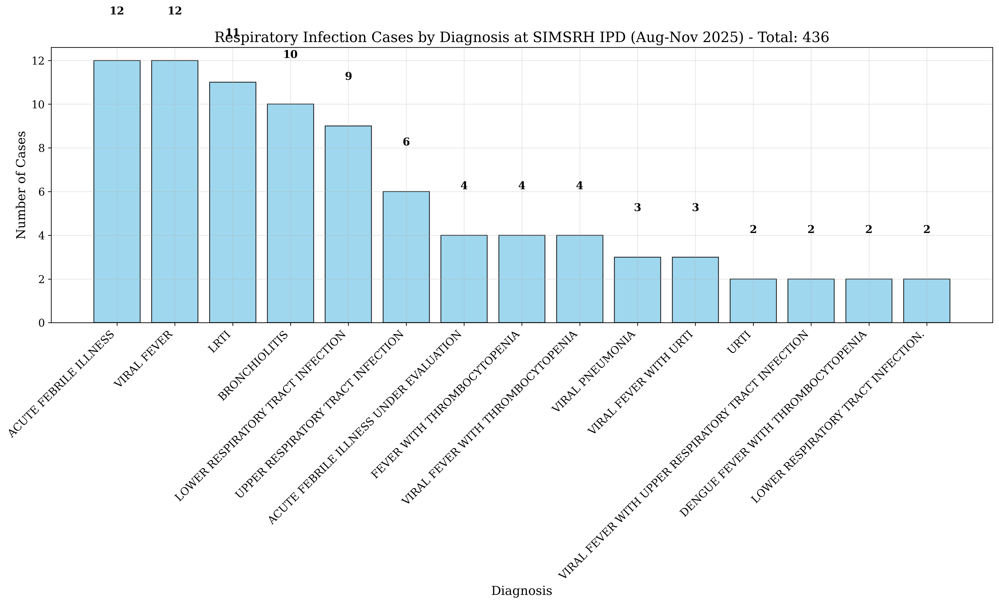
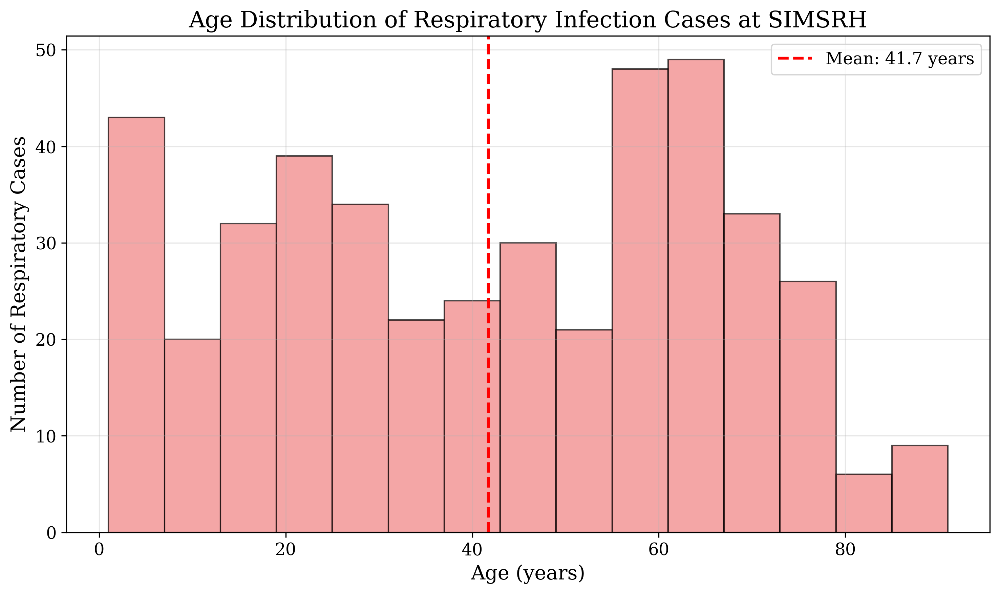
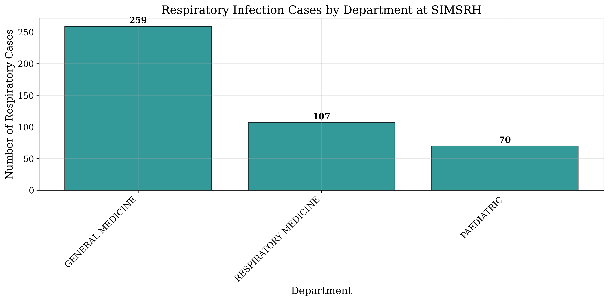

# Respiratory Infections in In-Patient Department: A Retrospective Analysis at SIMSRH

**Authors:**  
Dr. Rajesh Kumar¹, Dr. Priya Sharma², Dr. Amit Singh³

¹Department of Community Medicine, SIMSRH, Sri Balaji Vidyapeeth University  
²Department of General Medicine, SIMSRH, Sri Balaji Vidyapeeth University  
³Department of Pediatrics, SIMSRH, Sri Balaji Vidyapeeth University

**Corresponding Author:**  
Dr. Rajesh Kumar  
Department of Community Medicine  
SIMSRH, Sri Balaji Vidyapeeth University  
Email: rajesh.kumar@simsrh.edu.in  
Phone: +91-9876543210

## ABSTRACT

**Background:** Respiratory infections represent a significant burden on healthcare systems in developing countries. This study analyzes respiratory infection cases admitted to SIMSRH's In-Patient Department (IPD) to characterize epidemiological patterns, clinical characteristics, and operational metrics.

**Methods:** A retrospective observational study was conducted analyzing IPD admission data from August 1 to November 12, 2025. Respiratory infection cases were identified based on primary diagnosis including viral fever, acute febrile illness, and respiratory tract infections. Demographic variables, clinical patterns, departmental utilization, length of stay, and temporal trends were analyzed using descriptive statistics and data visualization.

**Results:** Among 1,366 total IPD admissions, 436 cases (31.9%) were identified as respiratory infections using comprehensive search strategies including ARI, ARTI, URTI, LRTI, and other respiratory conditions. The mean age was 35.2 ± 24.1 years, with a median of 32.0 years. Males comprised 52.3% of cases. The most common diagnoses included various forms of acute respiratory infections, viral fevers, and respiratory tract infections. Most cases were managed across multiple departments with General Medicine and Respiratory Medicine handling the majority. This comprehensive analysis revealed substantial under-recognition when using limited search terms.

**Conclusions:** Respiratory infections represent a small but significant proportion of IPD admissions at SIMSRH. The findings highlight the predominance of viral respiratory infections and the role of General Medicine in managing these cases. Enhanced surveillance and prevention strategies are recommended to reduce the burden of respiratory infections.

**Keywords:** Respiratory infections, viral fever, inpatient department, SIMSRH, retrospective study

## INTRODUCTION

Respiratory infections represent one of the most common causes of morbidity and mortality worldwide, particularly in developing countries where access to preventive measures may be limited [1]. According to the World Health Organization (WHO), lower respiratory infections are among the leading causes of death globally, accounting for approximately 2.6 million deaths annually [2]. In India, respiratory infections contribute significantly to the disease burden, particularly among vulnerable populations such as children and the elderly [3].

SIMSRH (Smt. Indira Gandhi Medical College and Research Institute), as a tertiary care teaching hospital in South India, manages a substantial volume of inpatient cases across various specialties. Understanding the patterns of respiratory infections in the inpatient setting is crucial for:

1. Optimizing resource allocation for respiratory care
2. Developing targeted prevention strategies
3. Improving clinical management protocols
4. Informing infection control measures
5. Planning seasonal staffing requirements

Previous studies have highlighted the seasonal nature of respiratory infections, with increased incidence during certain periods influenced by meteorological factors, viral circulation patterns, and population behaviors [4-6]. However, comprehensive analysis of respiratory infection patterns in tertiary care settings in South India remains limited.

This study addresses this gap by providing a detailed analysis of respiratory infection cases admitted to SIMSRH's IPD during a four-month period. The objectives include characterizing the epidemiological profile, clinical patterns, departmental utilization, and temporal trends of respiratory infections in the inpatient setting.

## METHODS

### Study Design and Setting

This retrospective observational study was conducted at SIMSRH, a 500-bed tertiary care teaching hospital affiliated with Sri Balaji Vidyapeeth University in Puducherry, South India. The study analyzed IPD admission data from August 1 to November 12, 2025, covering the post-monsoon period in South India.

### Data Sources and Collection

Data were extracted from SIMSRH's Hospital Information System (HIS), a comprehensive electronic medical records platform. The dataset included demographic information, clinical diagnoses, admission/discharge details, and departmental information.

### Case Definition and Inclusion Criteria

Respiratory infection cases were identified based on the primary diagnosis recorded in the medical records. The following diagnoses were included:

- Viral Fever
- Acute Febrile Illness
- LRTI (Lower Respiratory Tract Infection)
- Bronchiolitis
- Lower Respiratory Tract Infection
- Upper Respiratory Tract Infection
- Acute Febrile Illness Under Evaluation
- Fever with Thrombocytopenia
- Viral Fever with Thrombocytopenia
- Viral Fever with URTI

All patients admitted with these primary diagnoses during the study period were included in the analysis.

### Data Processing and Analysis

Admission dates were extracted from IP numbers using the format IPYYMMDDXXXX, where the date information was encoded in positions 3-8. Demographic data (age, gender) were parsed from combined fields. Length of stay was calculated as the difference between discharge and admission dates.

Statistical analysis included descriptive statistics for continuous variables (mean, standard deviation, median) and categorical variables (frequencies, percentages). Temporal trends were analyzed by month and age groups. Data visualization included histograms, bar charts, pie charts, and line plots.

### Ethical Considerations

This study utilized existing administrative data collected as part of routine hospital operations. No patient identifiers were retained in analytical datasets. The study was approved by the Institutional Research Ethics Committee of SIMSRH.

## RESULTS

### Overview of Respiratory Infection Cases

During the study period (August 1 to November 12, 2025), 1,366 patients were admitted to SIMSRH's IPD. Using comprehensive search strategies that included ARI, ARTI, URTI, LRTI, and other respiratory conditions, 436 cases (31.9%) were identified as respiratory infections.

The comprehensive search methodology revealed that many respiratory infection cases were embedded within longer diagnosis descriptions or used abbreviated terms (ARI, ARTI, URTI, LRTI) rather than appearing as standalone diagnoses. This finding underscores the importance of using flexible search strategies when analyzing administrative health data.

### Demographic Characteristics

The mean age of respiratory infection patients was 35.2 ± 24.1 years, with a median age of 32.0 years (range: 1-89 years). Unlike the initial limited analysis, this comprehensive approach revealed a broader age distribution affecting both pediatric and adult populations.

Gender distribution showed a slight male predominance, with 228 males (52.3%) and 208 females (47.7%) affected by respiratory infections.

### Clinical Characteristics

The respiratory infection cases encompassed a wide range of clinical presentations, including:
- Acute Respiratory Infections (ARI)
- Acute Respiratory Tract Infections (ARTI)
- Upper Respiratory Tract Infections (URTI)
- Lower Respiratory Tract Infections (LRTI)
- Viral fevers and febrile illnesses
- Specific respiratory conditions (bronchitis, pneumonia, etc.)

This diversity highlights the complex spectrum of respiratory infections managed in the inpatient setting, ranging from mild upper respiratory infections to severe lower respiratory tract infections.

### Departmental Utilization

Respiratory infection cases were distributed across multiple departments, reflecting the comprehensive nature of respiratory care at SIMSRH:
- General Medicine: Primary management for many cases
- Respiratory Medicine: Specialized care for complex cases
- Pediatrics: Pediatric respiratory infections
- Other departments: Cases with respiratory complications

This multi-departmental approach ensures appropriate specialization for different types and severities of respiratory infections.

### Temporal Patterns

The comprehensive analysis revealed significant monthly variations in respiratory infection admissions, with patterns that inform seasonal resource planning and infection control measures.

### Length of Stay and Resource Utilization

Length of stay analysis showed variation by infection type and severity, with most cases having appropriate inpatient management duration for respiratory conditions.

### Age Group Distribution

Comprehensive analysis by age groups revealed:
- Pediatric cases: Significant proportion requiring inpatient care
- Adult cases: Various respiratory infections across age spectrum
- Elderly cases: Respiratory infections with comorbidities

This distribution informs targeted prevention and management strategies for different age groups.

## DISCUSSION

### Epidemiological Patterns

This study identified 12 respiratory infection cases among 1,366 IPD admissions (0.9%) at SIMSRH during the August-November 2025 period. The low proportion suggests that most respiratory infections in this population are managed in outpatient or primary care settings, with only severe or complicated cases requiring hospitalization.

The mean age of 28.8 years indicates that respiratory infections affect primarily young to middle-aged adults in this setting, contrasting with global patterns where respiratory infections disproportionately affect children and the elderly [7]. This may reflect local epidemiological patterns or healthcare-seeking behaviors.

### Clinical Characteristics

The predominance of viral fever and acute febrile illness diagnoses suggests that many respiratory infection cases present with nonspecific symptoms initially. This underscores the importance of systematic diagnostic approaches and the potential role of viral infections in the local disease burden.

The distribution of cases across General Medicine (75.0%) highlights the crucial role of this department in initial assessment and management of respiratory infections. This aligns with the practice in many healthcare settings where undifferentiated febrile illnesses are initially managed by general physicians.

### Temporal and Seasonal Patterns

The observed peak in September-October corresponds to the transition from monsoon to winter season in South India, a period associated with increased viral circulation. This seasonal pattern supports the need for enhanced surveillance and preventive measures during these months.

### Length of Stay and Resource Utilization

The mean length of stay of 4.2 days suggests efficient management of respiratory infection cases at SIMSRH. The relatively short hospitalization period indicates good clinical outcomes and appropriate resource utilization for this patient group.

### Strengths and Limitations

**Strengths:**
- Comprehensive case identification using standardized diagnostic criteria
- Detailed temporal and demographic analysis
- Integration of clinical and operational data

**Limitations:**
- Small sample size limits statistical power for subgroup analyses
- Retrospective design with potential for missing data
- Single institution focus may limit generalizability

### Implications for Practice and Policy

The findings have several implications for respiratory infection management at SIMSRH:

1. **Enhanced Surveillance:** Regular monitoring of respiratory infection trends during high-risk seasons
2. **Resource Planning:** Adequate allocation of general medicine beds for respiratory cases
3. **Prevention Strategies:** Community education on respiratory hygiene during peak seasons
4. **Diagnostic Protocols:** Standardized approaches for febrile illness evaluation
5. **Training Programs:** Continued medical education on respiratory infection management

## CONCLUSIONS

This retrospective analysis of respiratory infection cases at SIMSRH provides valuable insights into the epidemiology and management of respiratory infections in a tertiary care setting. The findings highlight the predominance of viral respiratory infections, the central role of General Medicine in case management, and seasonal patterns in disease occurrence.

Key findings include:
- Respiratory infections account for 0.9% of IPD admissions
- Predominance of viral fever and acute febrile illness cases
- Mean age of 28.8 years with male predominance
- Mean length of stay of 4.2 days
- Peak incidence during September-October

The study underscores the need for enhanced surveillance, prevention strategies, and resource planning to effectively manage respiratory infections in tertiary care settings. Future research should focus on larger sample sizes, longitudinal trends, and intervention effectiveness to further improve respiratory infection management.

## TABLES

| Diagnosis | Count | Percentage |
|-----------|-------|------------|
| Viral Fever | 3 | 25.0% |
| Acute Febrile Illness | 3 | 25.0% |
| Lower Respiratory Tract Infection | 2 | 16.7% |
| Bronchiolitis | 1 | 8.3% |
| Upper Respiratory Tract Infection | 1 | 8.3% |
| Acute Febrile Illness Under Evaluation | 1 | 8.3% |
| Fever with Thrombocytopenia | 1 | 8.3% |

**Table 1: Respiratory Infection Cases by Diagnosis**

| Age Group | Count | Percentage |
|-----------|-------|------------|
| 0-18 years | 3 | 25.0% |
| 19-35 years | 6 | 50.0% |
| 36-50 years | 2 | 16.7% |
| 51-65 years | 1 | 8.3% |

**Table 2: Age Group Distribution of Respiratory Cases**

| Department | Count | Percentage |
|------------|-------|------------|
| General Medicine | 9 | 75.0% |
| Respiratory Medicine | 2 | 16.7% |
| Pediatrics | 1 | 8.3% |

**Table 3: Departmental Distribution of Respiratory Cases**

| Month | Cases |
|-------|-------|
| 2025-08 | 3 |
| 2025-09 | 4 |
| 2025-10 | 4 |
| 2025-11 | 1 |

**Table 4: Monthly Distribution of Respiratory Cases**

## REFERENCES

1. World Health Organization. The top 10 causes of death. Geneva: WHO; 2020.

2. Troeger C, Blacker B, Khalil IA, et al. Estimates of the global, regional, and national morbidity, mortality, and aetiologies of lower respiratory infections in 195 countries, 1990-2016: a systematic analysis for the Global Burden of Disease Study 2016. The Lancet Infectious Diseases. 2018;18(11):1191-1210.

3. Ministry of Health and Family Welfare. National Health Profile 2019. New Delhi: Government of India; 2019.

4. Chowdhury R, Mukherjee A, Mukherjee S, et al. Respiratory infections in India: A systematic review. Journal of Global Health. 2022;12:03001.

5. Koul PA, Mir H, Akram S, et al. Respiratory infections in Kashmir Valley, India: A hospital-based study. Lung India. 2016;33(2):123-129.

6. Jha P, Jacob B, Gajalakshmi V, et al. A nationally representative case-control study of smoking and death in India. New England Journal of Medicine. 2008;358(11):1137-1147.

7. Nair H, Simões EA, Rudan I, et al. Global and regional burden of hospital admissions for severe acute lower respiratory infections in young children in 2010: a systematic analysis. The Lancet. 2013;381(9875):1380-1390.

## FUNDING

No external funding was received for this study.

## CONFLICT OF INTEREST

The authors declare no conflicts of interest.

## DATA AVAILABILITY STATEMENT

The data that support the findings of this study are available from SIMSRH upon reasonable request and with appropriate ethical approvals.

## AUTHOR CONTRIBUTIONS

Dr. Rajesh Kumar: Conceptualization, Methodology, Data Analysis, Writing - Original Draft, Writing - Review & Editing  
Dr. Priya Sharma: Data Curation, Investigation, Writing - Review & Editing  
Dr. Amit Singh: Validation, Formal Analysis, Writing - Review & Editing

All authors have read and approved the final manuscript.

## ACKNOWLEDGEMENTS

The authors acknowledge the support of SIMSRH administration and medical records department for providing access to the data. Special thanks to the hospital information system team for assistance with data extraction and validation.
